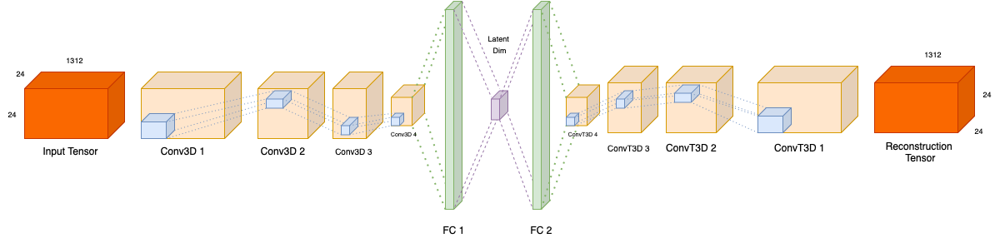
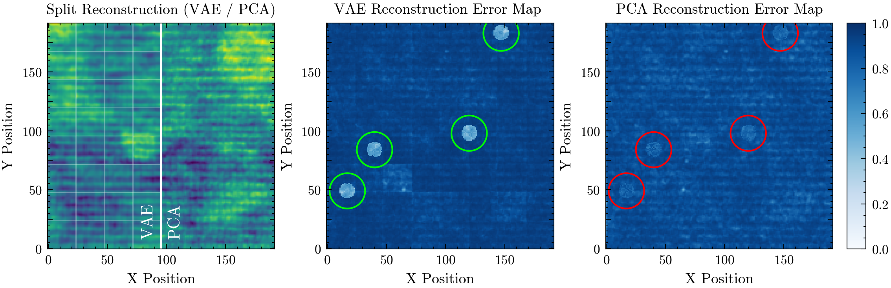

# CVAE3D: Anomaly Detection in EELS Data

A Three-Dimensional Convolutional Variational Autoencoder (3D-CVAE) for automated anomaly detection in Electron Energy Loss Spectroscopy Spectrum Imaging (EELS-SI) data.


*3D-CVAE architecture*

## Table of Contents

The repository is still being populated with the features from the original project. New sections will be created as the features are ported to this repository. 

- [Introduction](#introduction)
    - [What is EELS-SI?](#what-is-eels-si)
    - [The Challenge](#the-challenge)
    - [Our Solution](#our-solution)
- [Installation](#installation)
- [Project Structure](#project-structure)
- [Configuration](#configuration)
- [Usage](#usage)
    - [AutoTraining](#autotraining)
    - [Data Loading and Preprocessing](#data-loading-and-preprocessing)
    - [Training the Model](#training-the-model)

## Introduction

### What is EELS-SI?

Electron Energy Loss Spectroscopy Spectrum Imaging (EELS-SI) is a powerful technique in materials characterization that combines scanning transmission electron microscopy (STEM) with electron energy-loss spectroscopy. This method generates detailed 3D datacubes containing information about:
- Elemental composition
- Electronic structure
- Chemical bonding
- Local atomic environments

Each point in an EELS-SI dataset represents a spectrum showing how electrons lose energy as they interact with a material, providing atomic-level insights into material properties.

### The Challenge

Traditional analysis of EELS-SI data relies heavily on manual inspection or simple statistical methods like Principal Component Analysis (PCA). These approaches have limitations:
- Time-consuming manual analysis
- Difficulty in detecting subtle spectral anomalies
- Limited ability to capture complex spatial-spectral relationships
- Risk of missing important material features or defects

### Our Solution

This project introduces a novel deep learning approach using a 3D-CVAE architecture that:
- Automatically detects spectral anomalies
- Preserves both spatial and spectral correlations
- Operates directly on raw EELS-SI data
- Outperforms traditional PCA-based methods


*Comparison of VAE and PCA reconstructions and their anomaly detection performance*

## Installation

To install and run the Minimal Viable Product (MVP) of the project, follow these steps:

```bash
git clone https://github.com/seyfal/3DCVAE.git
cd anomaly_detection
pip install -r requirements.txt
```

## Project Structure

```
anomaly_detection/
├── config/
│   ├── config_handler.py
│   └── config.yaml # Training configuration file
├── data/
│   └── data_loader.py 
├── models/
│   └── cvae3d.py
├── training/
│   └── train.py
└── utils/
    ├── utils.py
    └── latent_space_viz.py # Experimental

data/
└── BFO_a-0090_dark_ref_corrected.dm3 
    # Sample EELS-SI datacube that we used in our experiments
```

## Configuration

The project uses YAML configuration files for experiment settings. Key configuration parameters include:

```yaml
# Data settings
data_path: 'path/to/data'       # path to the datafile
energy_range: [420, 820]        # energy range for the EELS data in eV

# Model settings
device: 'cuda'                  # or 'cpu'
latent_dim: 48

# Training settings
learning_rate: 1e-4
kl_weight: 1                    # the beta parameter for the KL divergence
epochs: 300                     # number of training epochs 

# Preprocessing settings
image_size: 24                  # size of the shards in the spatial dimensions (x, y)  
                                # where z is the spectral dimension 
sigma: 0.5                      # Gaussian smoothing filter
xy_window: 3                    # denoising window size for the median filter 
anomaly_indices: [18]           # to exclude a certain shard index from the training set
sliding_window_stride: 24       # stride for the sliding window generating the dataset. 
                                # default is equal to the image size to prevent overlap 
                                # between shards 
scaling_method: 'robust_minmax' # other options are 'zscore', 'quantile' and 'minmax'
```

See `config/config.yaml` for the complete configuration options. More options will be continuously added as I port the features to this repository.

## Usage

### AutoTraining

```bash
python main.py --config_path config/config.yaml --mode train
```

### Data Loading and Preprocessing

```python
from anomaly_detection.data.data_loader import EELSDataset

# Initialize dataset
dataset = EELSDataset(config)

# Access preprocessed data
preprocessed_data = dataset.get_preprocessed_data()
```

### Training the Model

```python
from anomaly_detection.config.config_handler import get_config
from anomaly_detection.training.train import train_model

# Load configuration
config = get_config('path/to/config.yaml')

# Train model
model = train_model(config)
```